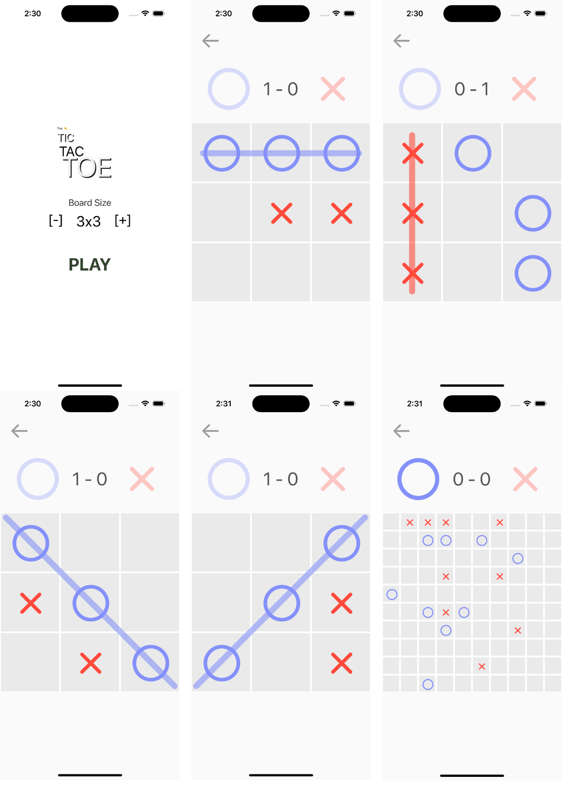
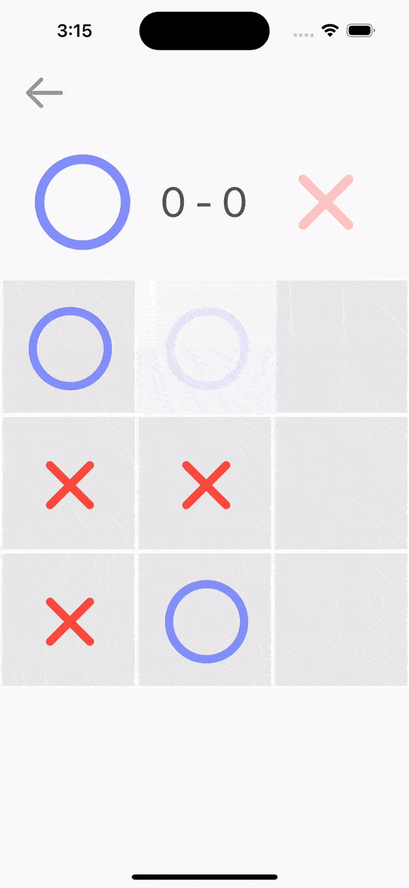
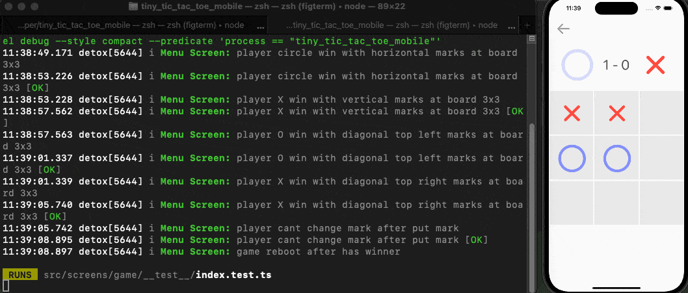
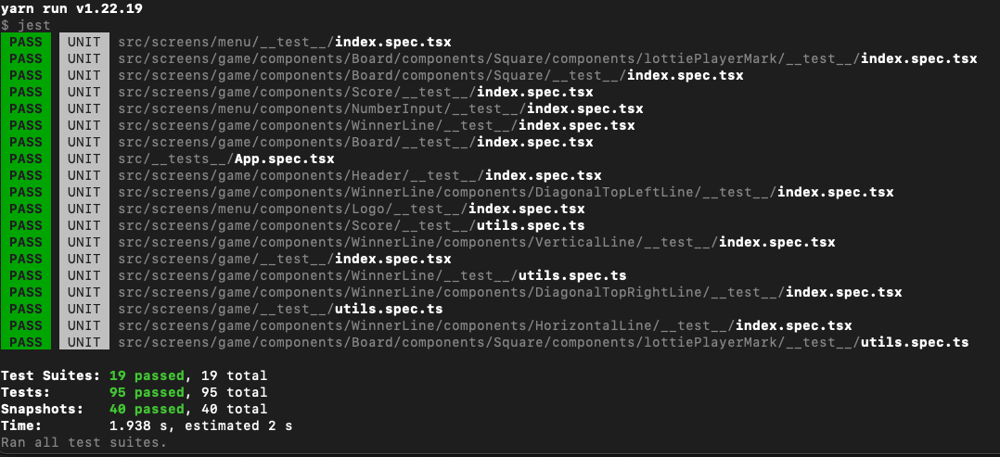

# 🤏 Tiny Tic Tac Toe
[](https://github.com/facebook/react)


[](https://www.typescriptlang.org/)
[]()
[]()
[]()


[]()
[](https://coveralls.io/github/mmbelkiman/tiny_tic_tac_toe_mobile?branch=main)

## Overview
This is a Tic-tac-toe game built with TypeScript and React Native,
designed to run seamlessly on both Android and iOS devices.
The primary focus of this project is to explore the fundamentals of creating
a mobile application using minimal external dependencies.

This project is not focused on how to create a video game.
I recommend exploring other technologies to learn more about game development.



### About Tic-tac-toe game
Tic-tac-toe,also known as noughts and crosses or Xs and Os,
is a classic two-player game that is easy to learn and can be played anywhere
with just a piece of paper and a pen.

The goal of Tic-tac-toe is to be the first player to form a line of three of
your marks (either "X" or "O") horizontally, vertically, or diagonally on the game board.

## Key Points
### Minimal Dependencies
This project is intentionally lightweight, aiming to minimize the reliance on
external libraries and frameworks. It serves as an excellent resource for
those looking to understand how to build a React Native application from the
ground up.

### Simple Animations
The game incorporates simple yet effective animations to enhance the player's
experience. These animations add a touch of interactivity and visual appeal
to the game.



### Comprehensive Testing
Testing is an integral part of this project.
It includes unit tests using Jest to ensure individual components and functions
are working correctly.
Additionally, end-to-end tests with Detox help validate the overall
functionality of the application.





#### Coverage Report
After running Jest tests for the first time, a new folder called `coverage` will be created. You can open the file `coverage/lcov-report/index.html` to view the
full coverage results from the previous test run.

### Component Decoupling
To foster modularity and reusability, each component is designed to be as
decoupled as possible. This means that components,
such as the player mark animations (`LottiePlayerMark`), can be easily extracted
and used in other projects without compatibility issues.
This is achieved by relying on primitive data types and minimizing shared dependencies.
```tsx
//Component example
<LottiePlayerMark
    color={'red'}
    backgroundColor={'blue'}
    isVisible={true}
    isCircle={false}
    squareSize={100}
/>
```

## Getting Started 
### Prerequisites
Before you begin, ensure you have met the react native requirements:  
[Setting up the development environment](https://reactnative.dev/docs/environment-setup)

### Installation
1. Clone this repository:
```bash  
git clone https://github.com/mmbelkiman/tiny_tic_tac_toe_mobile  
```
2. Navigate to the project's root directory:
```bash   
cd tiny_tic_tac_toe_mobile  
```
3. Install project dependencies:
```bash  
yarn install
```

## Scripts
In the project directory, you can run:

```bash  
yarn start
# Starts the Metro bundler  
```   
```bash
yarn ios`
# Runs the iOS app in the simulator.
```

```bash
yarn android 
# Runs the Android app in the emulator or connected device.  
```

```bash
yarn test:unit
# Launches the test runner with jest  
```

```bash
yarn test:2e2
# Launches the test runner with detox
# (is necessary the project is running with bundle at iOS simulator)
```

```bash
yarn detox:build:debug
# Builds the detox
```
## Packages Used
- [Jest](https://github.com/jestjs/jest): Famous JS testing library
- [Detox](https://github.com/wix/Detox): End-to-end testing and automation library for React Native.
- [Lottie-React-Native](https://github.com/lottie-react-native/lottie-react-native): Lottie is an ecosystem of libraries for parsing Adobe After Effects animations exported as JSON with bodymovin and rendering them natively!

## Contributing
If you'd like to contribute to this project or have any suggestions for improvements,
feel free to open an issue or submit a pull request.
I will be happy to discuss better approaches for this project.

## License
This project is open-source and available under the MIT License. You are free to use and modify the code as needed.

## TODO
- Show a message when the game is over (winner/draw)
- Add some sound effects
- Add a physical shake
- Add the possibility of playing versus a computer
- Add a new config to set how many points are necessary to win. e.g: At board 9x9, set to win a game with 3 sequential marks only
